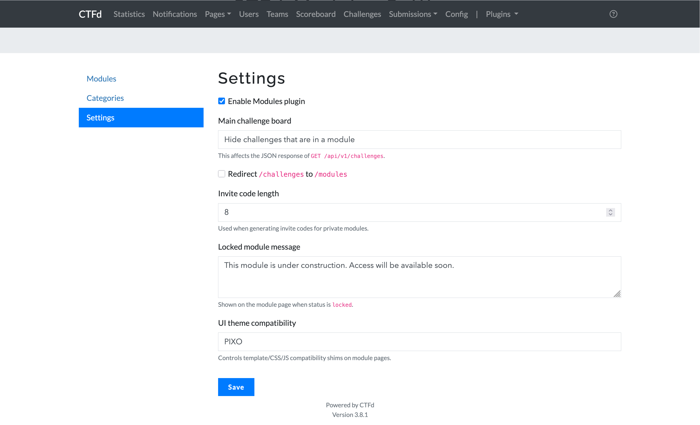
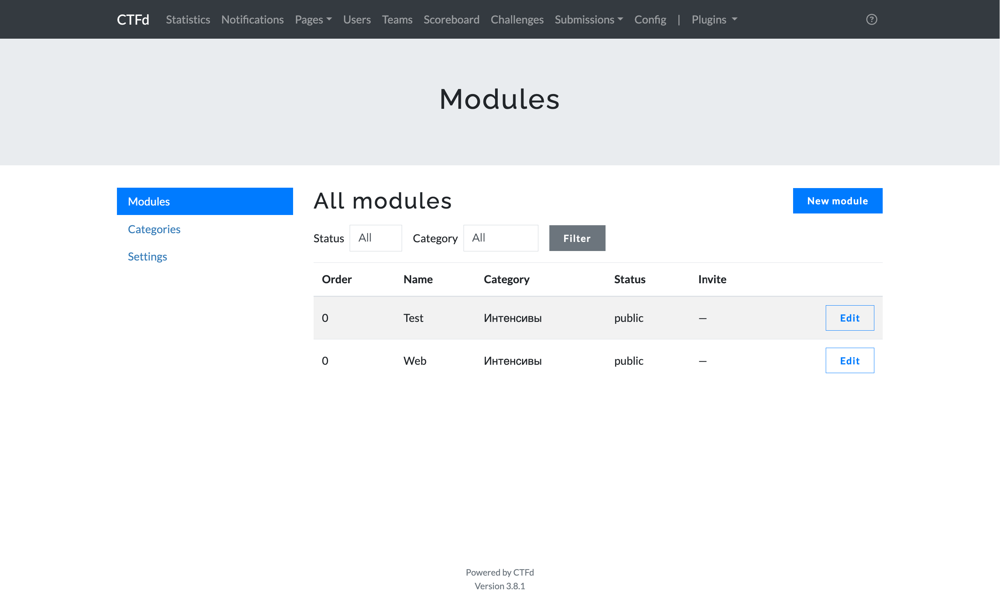
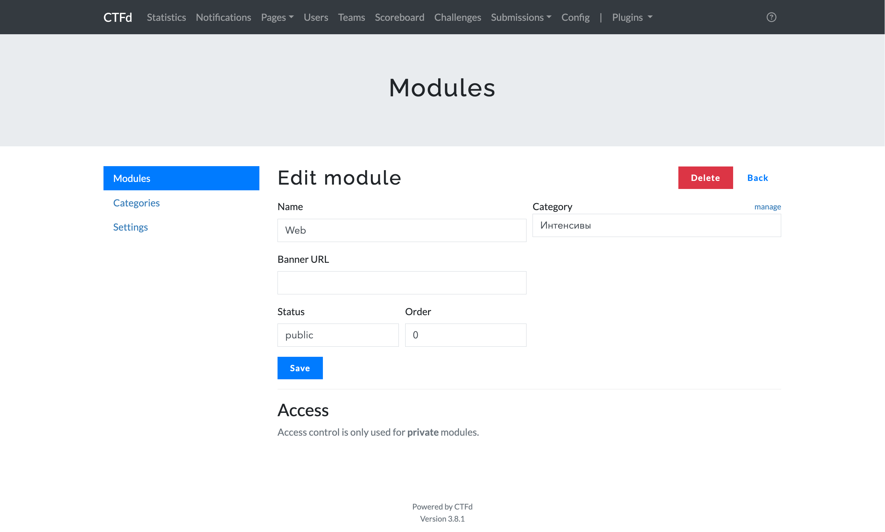
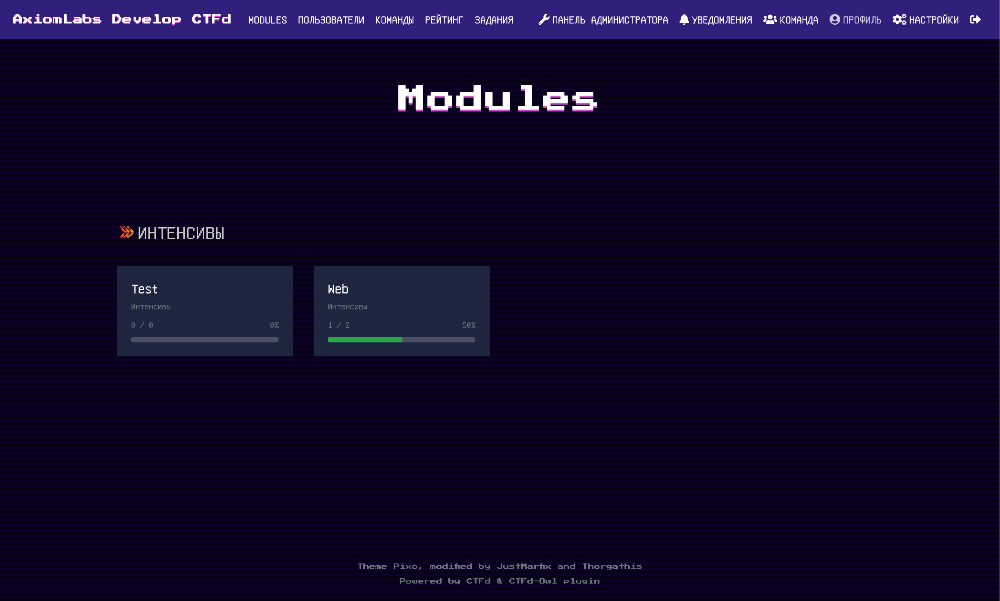
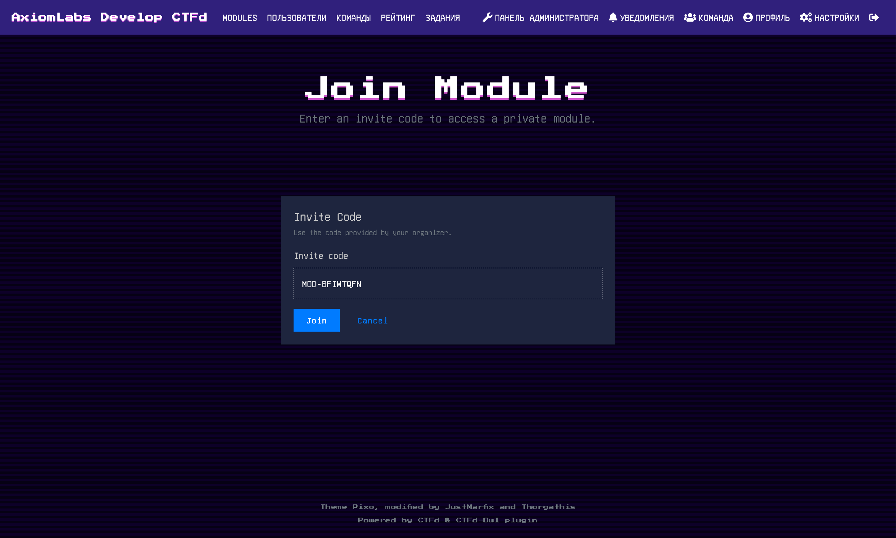
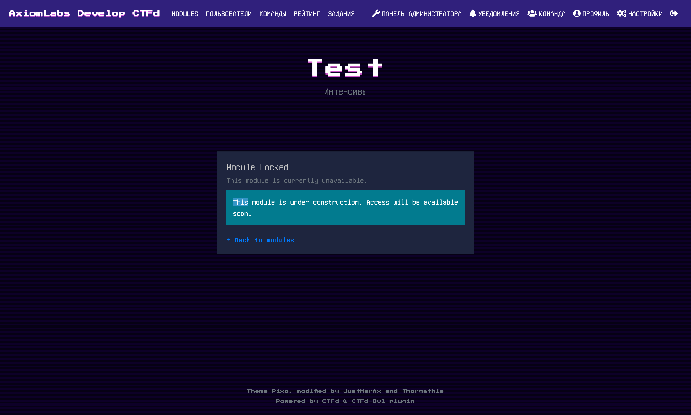
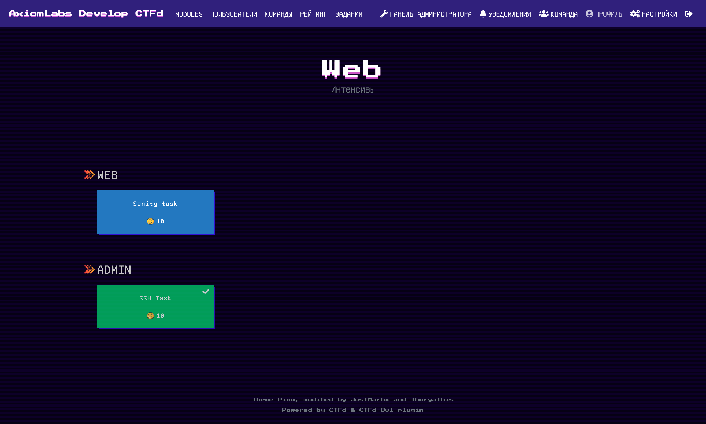

# CTFd Modules

Плагин для CTFd 3.x, который добавляет систему модулей (коллекций задач) с приватным доступом, invite-кодами и управлением отображением борды.

## Возможности

1. Группировка задач по модулям и категориям.
2. Статусы модуля: `public`, `private`, `locked`.
3. Доступ в приватный модуль:
   - вручную через админку,
   - по invite-коду.
4. Отдельные страницы для участников:
   - список модулей,
   - страница модуля,
   - join-страница,
   - locked-страница.
5. Контроль основной борды `/challenges`:
   - показывать все задачи,
   - только задачи из модулей,
   - только задачи вне модулей.
6. Совместимость с темами (`auto`, `pixo`, `core-beta`) и стабильная работа вкладки `Solves` в модалке.

## Основные URL

### Для участников

- `/modules` — список модулей.
- `/modules/<id>` — задачи модуля.
- `/modules/join?code=MOD-XXXXXXXX` — вход в приватный модуль по коду.

### Для админа

- `/plugins/ctfd_modules/admin/modules` — список и управление модулями.
- `/plugins/ctfd_modules/admin/categories` — категории модулей.
- `/plugins/ctfd_modules/admin/settings` — настройки плагина.

## Установка

**Требуется: CTFd 3.x**

1. Скопируйте папку `ctfd_modules/` в `CTFd/plugins/ctfd_modules/`.
2. Перезапустите CTFd.
3. Откройте `Admin -> Plugins -> CTFd Modules`.

## Конфигурация

### Настройки плагина

| Options | Content |
| :--- | :--- |
| **Enable Modules plugin** | Включение/выключение плагина |
| **Main challenge board** | Режим фильтрации `GET /api/v1/challenges`: `all`, `only_modules`, `only_unassigned` |
| **Redirect /challenges to /modules** | Редирект участников на страницу модулей |
| **Invite code length** | Длина invite-кода для приватных модулей |
| **Locked module message** | Текст для страницы locked-модуля |
| **UI theme compatibility** | Режим совместимости интерфейса: `auto`, `pixo`, `core-beta` |

### Список модулей (админка)

Что можно делать:

- фильтровать по статусу и категории;
- создавать новый модуль;
- переходить в редактирование модуля;
- удалять модуль.

### Карточка модуля (редактирование)

| Поле | Описание |
| :--- | :--- |
| **Name** | Название модуля |
| **Category** | Категория модуля |
| **Status** | `public` / `private` / `locked` |
| **Banner URL** | Баннер в карточке модуля |
| **Order** | Порядок в списке |
| **Invite Code** | Код доступа для private-модуля |

### Привязка задач к модулю

Поддерживаются оба потока:

1. При создании задачи выбираете модуль, после сохранения он подтягивается на странице редактирования.
2. При редактировании задачи модуль можно сменить/снять.

## Пользовательские страницы

### Список модулей

### Join-страница приватного модуля

### Locked-страница

### Страница задач модуля

### Известные баги

- При создании задачи модуль не устанавливается.